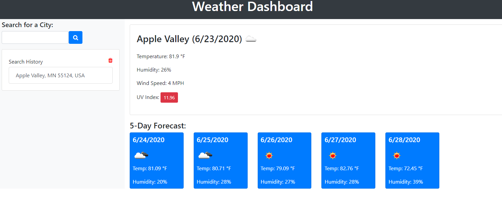

Weather API Project

The main goal of this project was analyzing code that we have been given to fully understand everything that was going on in it. We were also tasked with adding a new feature to the existing code. We added two features to the weather app. The first was a delete button, the purpose of this is to clear the local storage if the list gets to long. The second feature we was added was weather by location. We did this by getting location data from the browser and then pushing it through the google maps API to get a location. Then we searched the location using that information. 

This was a good project to really go through and understand the code and what was going on with each step. This also gave us practice using comments to be able to recreate the code that was there. This seems like a good practice to learn. 

Deployed site-https://cloudflying87.github.io/weatherAPI/
GitHub Repo - https://github.com/cloudflying87/weatherAPI